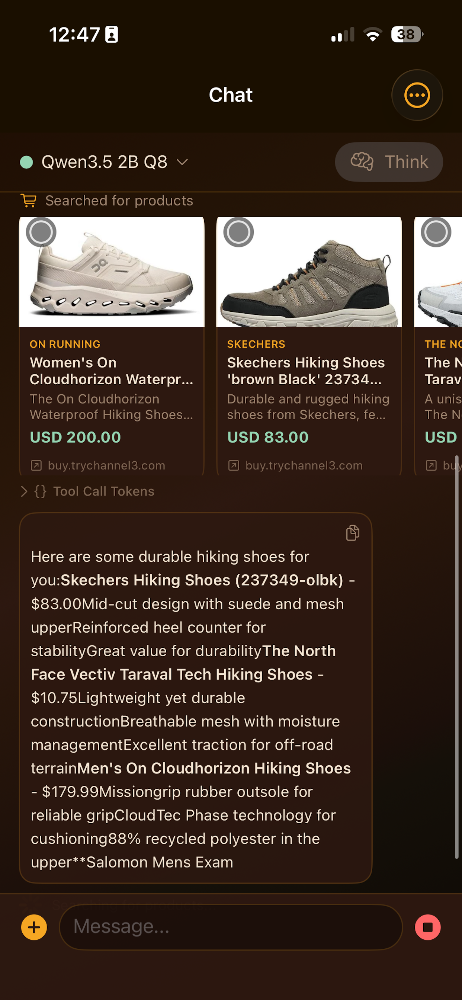

# ShoppingMate

**ShoppingMate** (repo: `MLXChat`) is an iPhone and iPad shopping assistant powered by an on-device foundation model. It runs Qwen3.5 locally via Apple MLX to provide product search, web search, and conversational Q&A — all without sending your queries to a cloud API.



The goal is a single-device shopping companion: ask questions, search for products, compare options, and get recommendations — with the language model running entirely on your phone or tablet.

## Why On-Device

- **Privacy** — shopping queries, budgets, and preferences never leave the device
- **Offline capability** — core Q&A works without a network connection; search tools enhance results when connectivity is available
- **Low latency** — no round-trip to a remote server for every response

## Core Features

- **Product search** — find and compare products with pricing via the Channel3 product API
- **Web search** — look up current deals, reviews, and product news via Brave Search
- **Conversational Q&A** — ask follow-up questions, get recommendations, and refine your search naturally
- **Interactive questionnaire** — the assistant gathers your budget, brand preferences, features, and use case before searching, so results are tailored to you
- **URL fetch** — paste a product page link and get a summary
- **Image input** — photograph a product and ask the model about it
- **Streaming responses** with Markdown rendering
- **Downloadable model picker** with progress tracking, cancel, and automatic retry
- **Configurable system prompt** with runtime variables (date, time, locale, location, device, etc.)

## Product Direction

- iPhone-first shopping UX with iPad support
- local inference with MLX — no cloud LLM dependency
- tool-augmented search for products, prices, and current information
- text-first performance, with image handling available when needed
- modern system UI that stays close to Apple defaults

## Repository Layout

- `MLXChat/` — iOS app source
- `MLXChat.xcodeproj/` — checked-in Xcode project
- `project.yml` — XcodeGen spec
- `ToolTest/` — macOS command-line test harness for model and tool behavior

## Requirements

- Xcode 16 or newer
- Apple Silicon recommended
- iOS 26 deployment target
- local disk space for MLX models

## Models

This repository does not ship model weights.

The app downloads models from Hugging Face repos under the `mlx-community` namespace. The picker is intentionally limited to Qwen3.5 MLX variants:

| Model | Quantization |
|-------|-------------|
| Qwen3.5-0.8B | Q4, Q8, BF16 |
| Qwen3.5-2B | Q4, Q8, BF16 |
| Qwen3.5-4B | Q4, Q8, BF16 |
| Qwen3.5-9B | Q4 |

**Recommended default:** `mlx-community/Qwen3.5-4B-MLX-4bit`

- materially better quality than the tiny models
- still usable on-device for shopping Q&A
- better latency than the larger 9B variant on iPhone

## Tools

ShoppingMate augments the on-device model with four tools:

### `tips`

Interactive questionnaire that gathers the user's preferences (budget, brand, features, use case) before performing a product search. This ensures search results are relevant and personalized.

### `product_search`

Searches for products and returns up to 10 results with titles, descriptions, pricing, and images via the Channel3 product API.

Example prompts:
- `Find me wireless earbuds under $50`
- `Compare running shoes from Nike and Adidas`
- `What are the best rated portable chargers?`

### `web_search`

Searches the web for current information — useful for recent reviews, deals, price drops, and product news.

Requirements: Brave Search API key in Settings.

Example prompts:
- `Are there any deals on AirPods this week?`
- `What are the latest reviews for the Samsung Galaxy S25?`
- `Search for Black Friday laptop deals`

### `url_fetch`

Fetches and reads the text content of a specific web page. Useful when a user pastes a product link and wants a summary.

Example prompts:
- `Read this product page and tell me the specs: https://example.com/product`
- `Summarize the reviews on this page`

Notes:
- The app prefetches obvious URL and search requests before generation, so the model answers from retrieved results
- For normal conversation, tools are intentionally not included in every turn

## Qwen3.5 Notes

This app is tuned specifically around Qwen3.5 behavior:

- Qwen3.5 should be controlled with `enable_thinking`, not prompt hacks like `/think` or `/no_think`
- text-only turns prefer the LLM path for speed
- tools work better when obvious tasks are prefetched by the app
- prompt and template details matter a lot for visible reasoning leakage

The codebase contains specific safeguards for:
- disabling visible reasoning where possible
- cutting off repetition loops
- handling tool calls conservatively
- keeping normal chat on the faster text-only path

## Running The App

1. Open `MLXChat.xcodeproj` in Xcode.
2. Select a device or simulator supporting iOS 26.
3. Build and run the `MLXChat` scheme.
4. Open **Settings**:
   - Set `GPU Memory Limit` and `Model Download Limit`
   - Enter a `Brave Search API Key` if you want web search
   - Enable tools
5. Open **Select Model** and download a model.
6. Start asking shopping questions.

## Settings

Key settings:

- `GPU Memory Limit`
- `Model Download Limit`
- `Context Size` (4K–32K)
- `Stream Responses`
- Image compression controls (max dimension, JPEG quality)
- System prompt with variable substitution
- Tools enablement and Brave API key

System prompt variables: `{today}`, `{date}`, `{time}`, `{datetime}`, `{timestamp}`, `{unixtime}`, `{location}`, `{address}`, `{coordinates}`, `{latitude}`, `{longitude}`, `{timezone}`, `{locale}`, `{device}`, `{system}`, `{version}`, `{username}`

## ToolTest

`ToolTest` is a macOS command-line harness for faster iteration on prompt, tool, and model behavior without deploying to a device.

```bash
cd ToolTest
swift build
swift run
```

## Project Generation

The checked-in Xcode project is intended to be usable directly. If you prefer regenerating it:

```bash
xcodegen generate
```

## Known Constraints

- Qwen3.5 still needs defensive handling around reasoning leakage
- larger models are practical on iPad before iPhone
- image turns are slower than text-only turns
- Brave-backed search quality depends on the configured API key
- product search results depend on Channel3 API availability

## Publishing Checklist

Before publishing or sharing builds:

1. Confirm the app icon and bundle identifier are correct
2. Confirm location, camera, and photo permission strings are intentional
3. Verify the selected deployment target
4. Test one plain chat, one product search, one web search, and one image turn on a real device
5. Remove any private API keys from local settings before screenshots or demos
# shoppingmate
